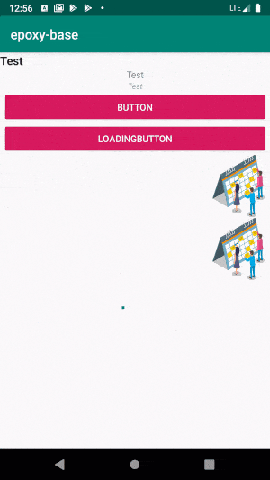

# Declarative Android Programming with [Epoxy](https://github.com/airbnb/epoxy)
This library offers helpful components and the framework to use epoxy from Airbnb in a easy and powerful declarative way of programming.
Often one develops many things twice that one could unify. 

This is exactly the basic idea behind epoxy.  This library offers a basic set of epoxy models, which are often used like texts, pictures and buttons. 



Prerequisite for the use of these is programming in Kotlin

## Basic Usage
If you use xml layouts without databinding you can create a model class to do the  binding.

```kotlin
class MainActivity : AppCompatActivity() {

    lateinit var binding: ActivityMainBinding
    var isLoading = false

    override fun onCreate(savedInstanceState: Bundle?) {
        super.onCreate(savedInstanceState)
        binding = DataBindingUtil.setContentView(this, R.layout.activity_main)
        binding.recyclerView.withModels {
            textModel("Test", type = Type.TITLE).addTo(this)
            textModel("Test", type = Type.REGULAR, gravity = Gravity.CENTER_HORIZONTAL).addTo(this)
            textModel("Test", type = Type.LIGHT, gravity = Gravity.CENTER_HORIZONTAL).addTo(this)

            buttonModel("Button", click = View.OnClickListener {
                // do stuff
                isLoading = !isLoading
                requestModelBuild()
            }).addTo(this)

            buttonModel("LoadingButton", click = View.OnClickListener {
                // do stuff
            }, isLoading = isLoading).addTo(this)

            imageModel(R.drawable.ic_no_appointments, w = 48, h = 48).addIf(!isLoading,this)

            heightSpacing(12)

            imageModel(R.drawable.ic_no_appointments, w = 96, h = 96, gravity = Gravity.END).addTo(this)

            loadingModel().addTo(this)


        }

    }

}
```

## Current Models

- TextModel
- ButtonModel (with the use of [MaterialLoadingButton](https://github.com/Muki1992/MaterialLoadingButton))
- ImageModel
- LoadingModel
- SpacingModel
- ProfileHeaderModel and SettingsItemModels

### Styling

The library tires to provide as many styling options as possible. From coloring (background, foreground) and spacing (left,right,top,bottom) to sizing and positioning.

## Installation

Gradle is the only supported build configuration, so just add the dependency to your project `build.gradle` file:

```groovy
dependencies {
  implementation 'com.github.Muki1992:epoxy-base:1.x.x'
  implementation 'com.airbnb.android:epoxy:3.0.0'
  kapt 'com.airbnb.android:epoxy-processor:3.0.0'
  implementation 'com.airbnb.android:epoxy-databinding:3.0.0'
}
```
In order for Kotlin to work properly add to the build.gradle
```
apply plugin: 'kotlin-kapt'

kapt {
    correctErrorTypes = true
}
```

## License


Copyright 2019 Mustafa Gercek

Licensed under the Apache License, Version 2.0 (the "License");
you may not use this file except in compliance with the License.
You may obtain a copy of the License at

    http://www.apache.org/licenses/LICENSE-2.0

Unless required by applicable law or agreed to in writing, software
distributed under the License is distributed on an "AS IS" BASIS,
WITHOUT WARRANTIES OR CONDITIONS OF ANY KIND, either express or implied.
See the License for the specific language governing permissions and
limitations under the License.
```
